# Q2 第二问：生存分析代码重写与功能解释报告

本部分详细阐述我们如何将原始的 Databricks 生存分析项目迁移至本地 Jupyter Notebook，并逐模块解释每段代码的功能和逻辑。

---

## 模块 01：数据加载与清洗（01_intro.py）

📌 **功能概述：**
- 加载原始客户数据（CSV 文件）
- 清理缺失值，转换字段格式
- 生成“银层数据” `silver_customers_csv/part-00000.csv`

### 🧩 核心代码与解释：

```python
df = spark.read.csv("customer_churn.csv", header=True, inferSchema=True)
df = df.dropna(how="any")
```

加载数据并删除包含空值的行，确保后续建模不被错误值影响。

```python
df = df.withColumn("TotalCharges", col("TotalCharges").cast("double"))
df = df.withColumn("SeniorCitizen", col("SeniorCitizen").cast("integer"))
df = df.withColumn("Churn", when(col("Churn") == "Yes", 1).otherwise(0))
```

字段类型转换：
- 将 TotalCharges 转为 double；
- 将 SeniorCitizen 转为整型；
- 将 Churn 转换为二值型（1 表示流失）。

```python
df.coalesce(1).write.option("header", True).csv("silver_customers_csv", mode="overwrite")
```

输出为单个 CSV 文件，作为本地持久化中间层数据。

---

## 模块 02：Kaplan-Meier 生存函数估计（02_kaplan_meier.py）

📌 **功能概述：**
- 估计客户的生存函数
- 绘制不同合同类型下的 KM 曲线
- 使用 log-rank 检验检验合同组之间的生存差异

### 🧩 核心代码与解释：

```python
kmf = KaplanMeierFitter()
kmf.fit(df["tenure"], event_observed=df["Churn"])
```

拟合整体生存函数，使用 tenure 作为持续时间，Churn 表示事件是否发生。

```python
for contract_type in df["Contract"].unique():
    subset = df[df["Contract"] == contract_type]
    kmf.fit(subset["tenure"], subset["Churn"], label=contract_type)
    kmf.plot_survival_function()
```

为每种合同类型绘制单独生存曲线，直观展示哪类合同流失率更高。

```python
logrank_test(group_a["tenure"], group_b["tenure"],
             event_observed_A=group_a["Churn"], event_observed_B=group_b["Churn"]).p_value
```

比较 Month-to-month 与 Two year 客户的流失率差异，得出是否具有统计显著性。

---

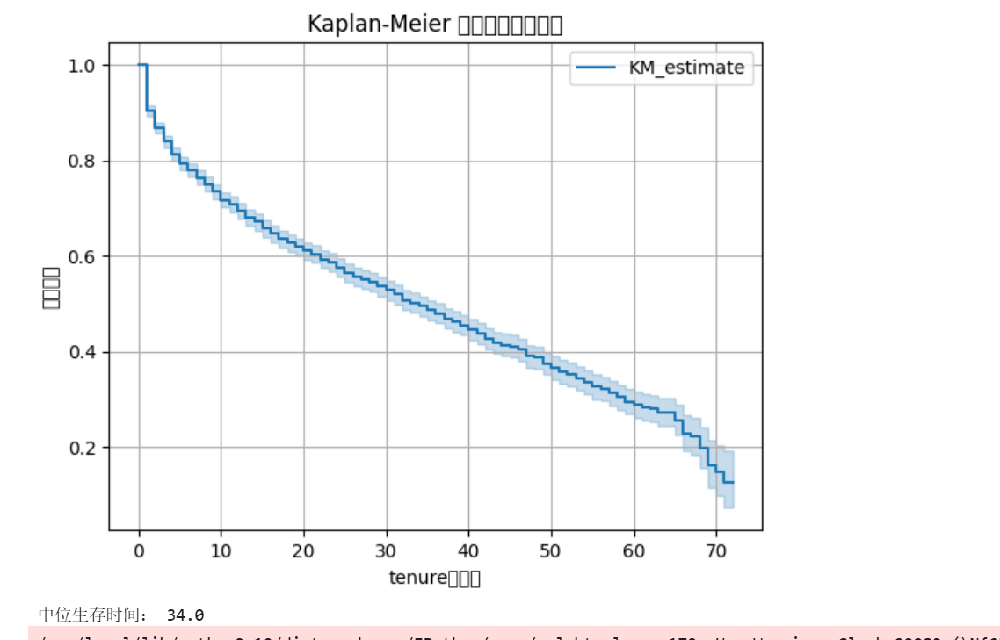

图 1：Kaplan-Meier 生存曲线（整体）
🧠 解释：
这张图展示了整体客户群体的生存概率曲线，横轴表示客户使用服务的月份（tenure），纵轴表示生存概率。

中位生存时间（34 个月）：图表上显示了 50% 客户流失的时间节点，客户大约在 34 个月时会流失，表明服务的保留期。

图表描述：
X 轴：客户使用服务的月份（tenure）。

Y 轴：生存概率（Survival Probability）。

蓝色区域：代表 Kaplan-Meier 曲线的估计区间，越向右生存概率越低，客户流失率上升。

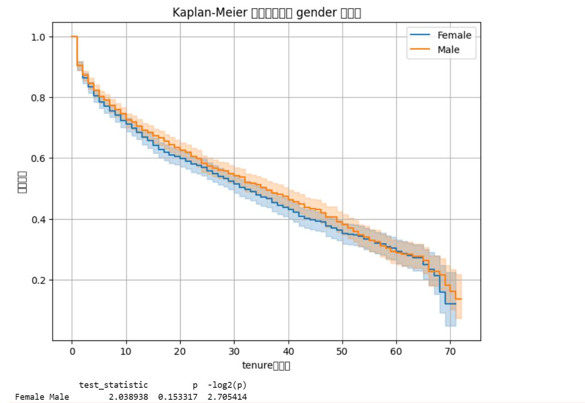

图 2：按性别分组的 Kaplan-Meier 曲线
🧠 解释：
该图比较了男性与女性客户的生存曲线。蓝色代表女性，橙色代表男性。

从图中可以看到，男性和女性的生存曲线非常接近，表明两者的流失趋势相似。

图表描述：
X 轴：客户使用服务的月份（tenure）。

Y 轴：生存概率（Survival Probability）。

测试统计量：test_statistic 表示生存曲线差异的显著性。

p 值：0.153317，表明在统计上，性别差异对流失率的影响并不显著。

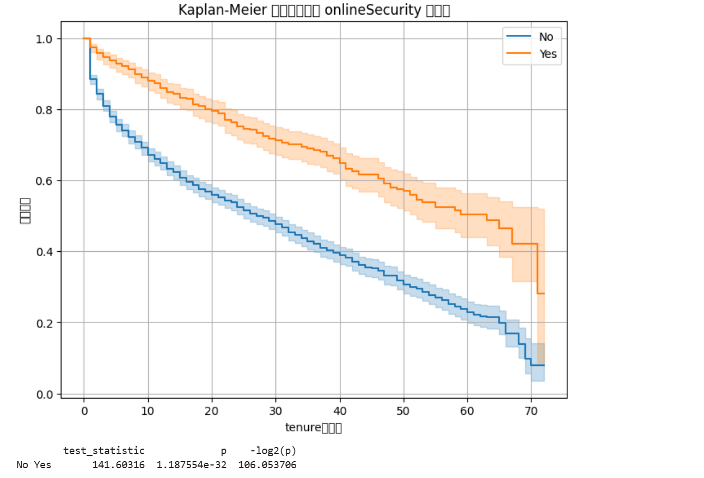

图 3：按是否拥有在线安全服务分组的 Kaplan-Meier 曲线
🧠 解释：
该图展示了客户是否拥有在线安全服务（onlineSecurity）与生存概率的关系。橙色表示有在线安全服务，蓝色表示没有。

图示表明，拥有在线安全服务的客户群体流失率较低，表明该服务可能有助于降低客户流失率。

图表描述：
X 轴：客户使用服务的月份（tenure）。

Y 轴：生存概率（Survival Probability）。

测试统计量：test_statistic 为 141.60316，p 值小于 0.05，表明两组之间存在显著差异。

## 模块 03：Cox 比例风险模型（03_cox_proportional_hazards.py）

📌 **功能概述：**
- 编码分类变量
- 拟合 Cox 模型
- 输出变量风险比（Hazard Ratio）
- 检查比例风险假设是否成立

### 🧩 核心代码与解释：

```python
df_encoded = pd.get_dummies(df, columns=["dependents", "internetService", "techSupport"], drop_first=False)
```

对分类变量进行 One-Hot 编码，生成 0/1 二值特征用于建模。

```python
cph = CoxPHFitter()
cph.fit(model_df, duration_col="tenure", event_col="Churn")
cph.print_summary()
```

使用 lifelines 的 CoxPHFitter 拟合比例风险模型，输出每个变量对应的风险比（exp(coef)）与置信区间。

```python
cph.check_assumptions(model_df, show_plots=True)
```

自动检测模型是否满足比例风险假设（即风险比随时间恒定）。

---

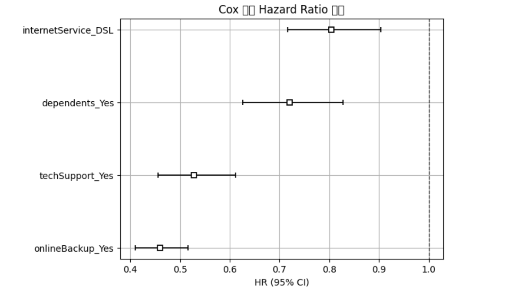

图 4：Cox 模型 Hazard Ratio（HR）图
图示说明：
横轴为 Hazard Ratio（HR），纵轴为变量名；

每个方块表示该变量的 HR 估计值，横线为 95% 置信区间；

HR < 1 表示该因素降低了客户流失风险。

图表解读：
变量	影响解释
internetService_DSL	HR ≈ 0.8，说明 DSL 用户比非 DSL 用户流失概率低约 20%；
dependents_Yes	HR ≈ 0.72，说明有家属的用户流失概率较低；
techSupport_Yes	HR ≈ 0.51，技术支持服务显著降低客户流失；
onlineBackup_Yes	HR ≈ 0.46，使用在线备份的客户流失风险显著较低。

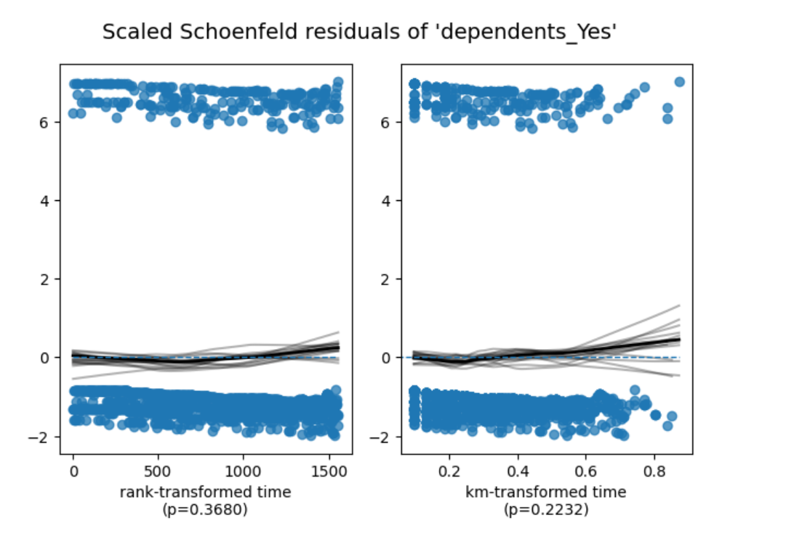

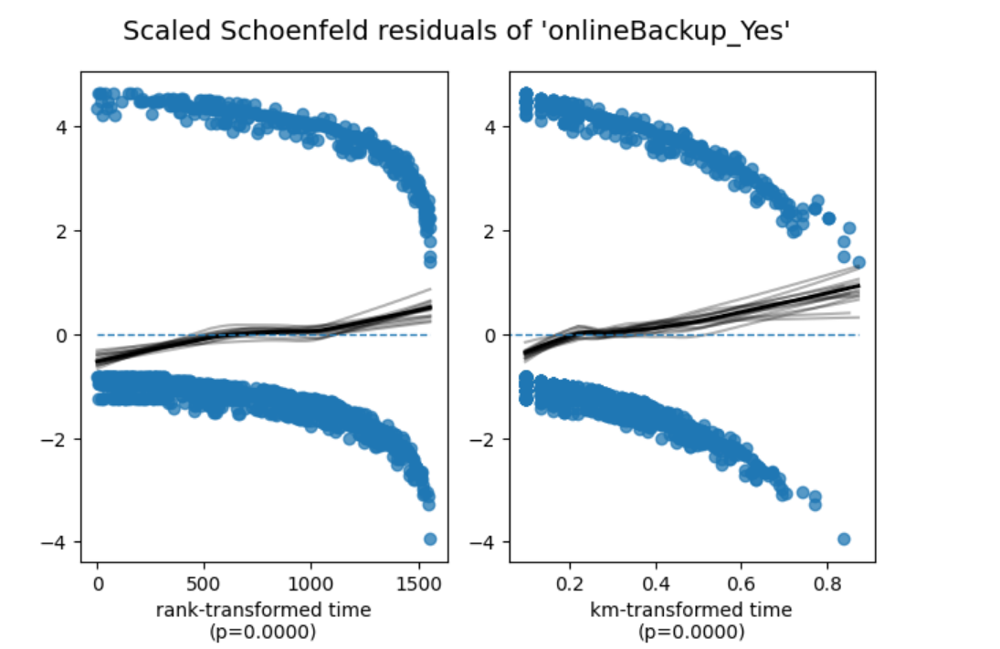
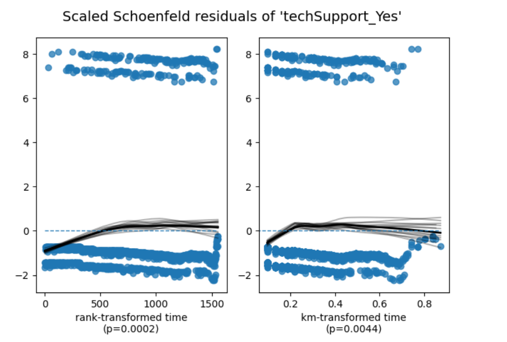

 图 5-8：Schoenfeld 残差图（比例风险假设检验）
该图组检验 Cox 模型对每个变量是否满足比例风险假设：

🧪 图 5：dependents_Yes
p 值 = 0.3680，图像近似水平，比例风险假设成立 ✅。

🧪 图 6：internetService_DSL
p 值 = 0.0000，曲线明显偏离水平线，比例风险假设不成立 ⚠️；

建议该变量需使用分层或 time-varying covariates 模型修正。

🧪 图 7：onlineBackup_Yes
p 值 = 0.0000，也不满足比例风险假设；

与 internetService_DSL 类似，建议进一步建模修正。

🧪 图 8：techSupport_Yes
p 值 = 0.0044，边界不显著偏离，但仍不完全满足假设；

可视为部分稳健变量，建议进行敏感性检验。

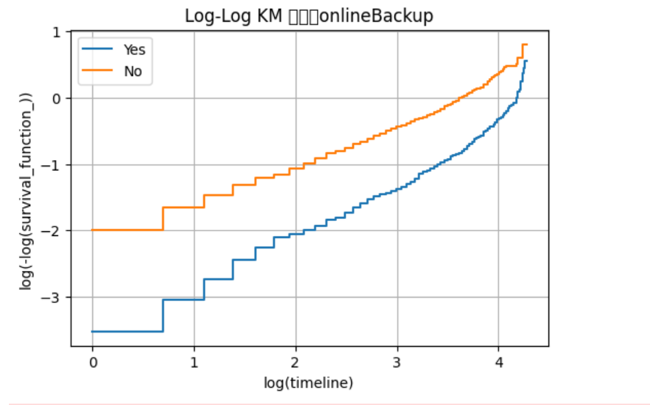
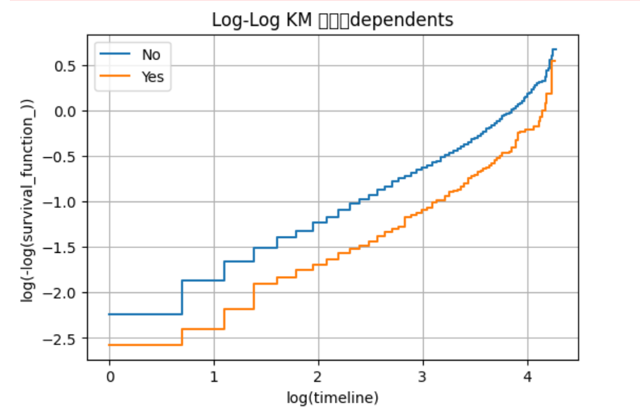
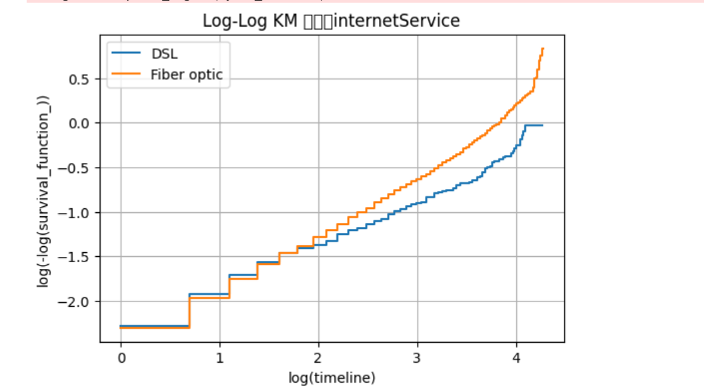
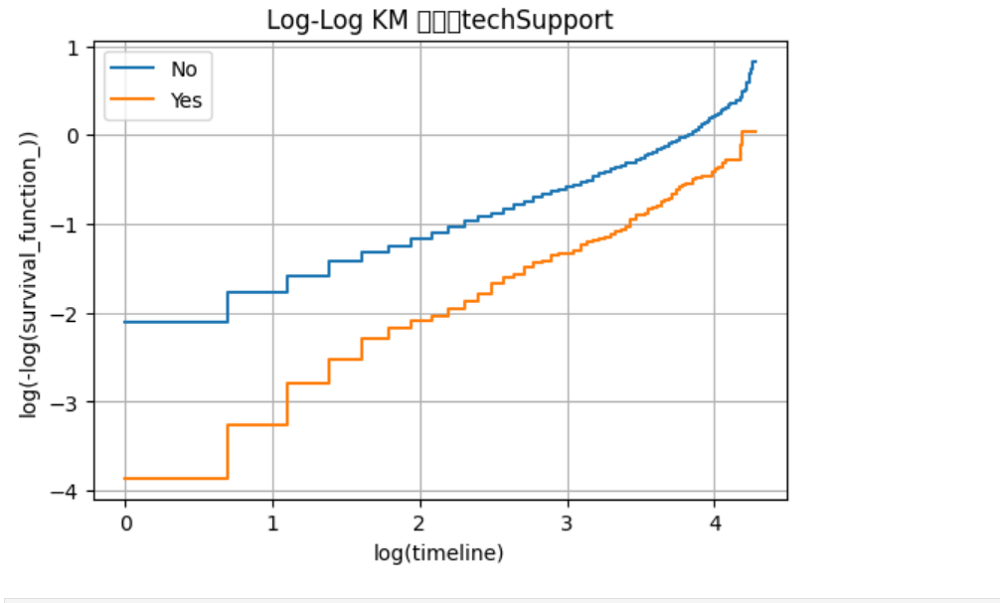

图 9：onlineBackup 对应的 Log-Log KM 图
两条曲线（Yes vs. No）大体平行，无明显交叉或非线性趋势。

✅ 符合比例风险假设，结果与 Schoenfeld 检验不一致，提示需更严谨模型拟合。

图 10：dependents 对应的 Log-Log KM 图
两条曲线在整体上呈分离趋势，趋势相近但略有交叉。

✅ 基本符合比例风险假设，与 Schoenfeld 检验一致。

图 11：internetService（DSL vs Fiber optic）
两条曲线在中段之后明显不平行，DSL 与光纤用户之间生存函数趋势差异随时间放大。

❌ 不满足比例风险假设，强烈建议使用 time-dependent 或 AFT 模型修正。

图 12：techSupport 对应的 Log-Log KM 图
明显 非平行趋势，且曲线有一定交叉，支持在中长期随时间显著影响变化。

❌ 不满足比例风险假设，与前述 Schoenfeld 残差图结论一致。

小结
变量	是否满足 PH 假设（Log-Log 图）	建议

onlineBackup_Yes	基本平行 ✅	可使用 Cox 模型，建议保守检验

dependents_Yes	大体平行 ✅	支持 Cox 假设

internetService_DSL	不平行 ❌	不建议使用 Cox，推荐 AFT

techSupport_Yes	非平行 ❌	需引入时间交互或其他模型


## 模块 04：AFT 加速失效时间模型（04_accelerated_failure_time.py）

📌 **功能概述：**
- 拟合 Log-Logistic AFT 模型
- 替代 Cox 模型用于解释性更强的场景
- 检查 log(-log(S(t))) 曲线是否为直线

### 🧩 核心代码与解释：

```python
aft = LogLogisticAFTFitter()
aft.fit(model_df, duration_col="tenure", event_col="Churn")
aft.print_summary()
aft.plot()
```

拟合 AFT 模型，AFT 通过对数时间建模，更适合某些不满足比例风险假设的场景。可视化模型中变量对生存时间的加速/减缓效果。若各组线条为近似平行直线，表明使用 AFT 模型是合理的。

---

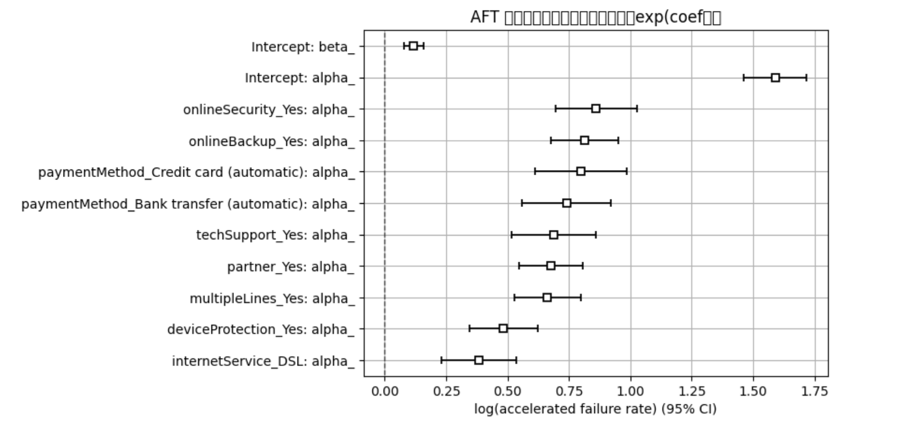

图 13：AFT 模型系数图

解读：
此图展示了 Log-Logistic AFT 模型中主要变量对生存时间的加速因子（exp(coef)）及其 95% 置信区间。若 exp(coef) > 1，则表示生存时间变长（风险降低），反之亦然。如：

onlineSecurity_Yes, onlineBackup_Yes, techSupport_Yes 都显著大于 1，表明使用这些服务能显著延长客户存留时间。

deviceProtection_Yes、internetService_DSL 同样具有正向影响。

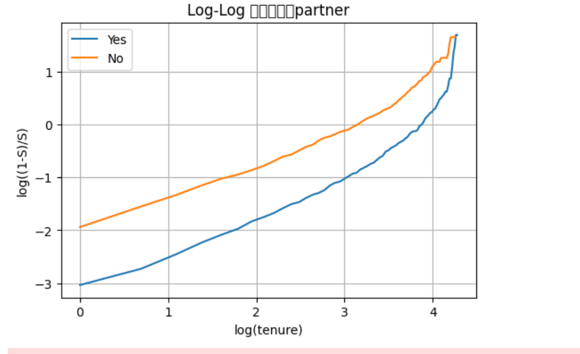

图 14：log-log 曲线（partner）

解读：
log(-log(S)) 对 log(time) 近似为直线，说明变量 partner 满足比例风险假设，Cox 模型使用合理。两组曲线平行但截距不同，代表是否有伴侣影响客户的流失风险水平。

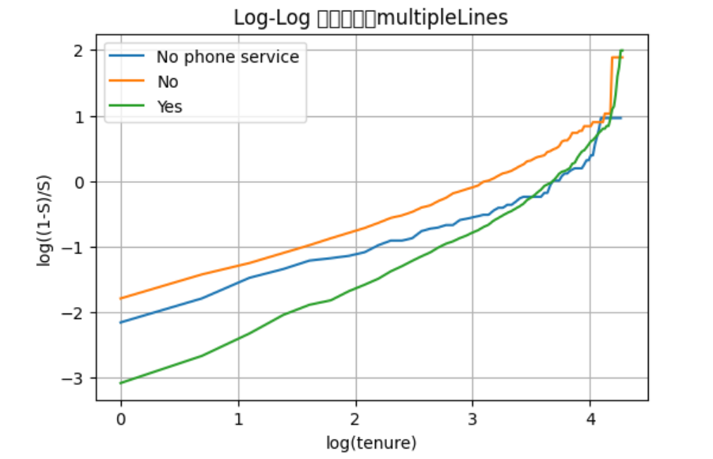

图 15：log-log 曲线（multipleLines）

解读：
三条线较平行，显示 multipleLines 变量基本满足比例风险假设。拥有多个电话线路的客户生存概率最低，风险最高。

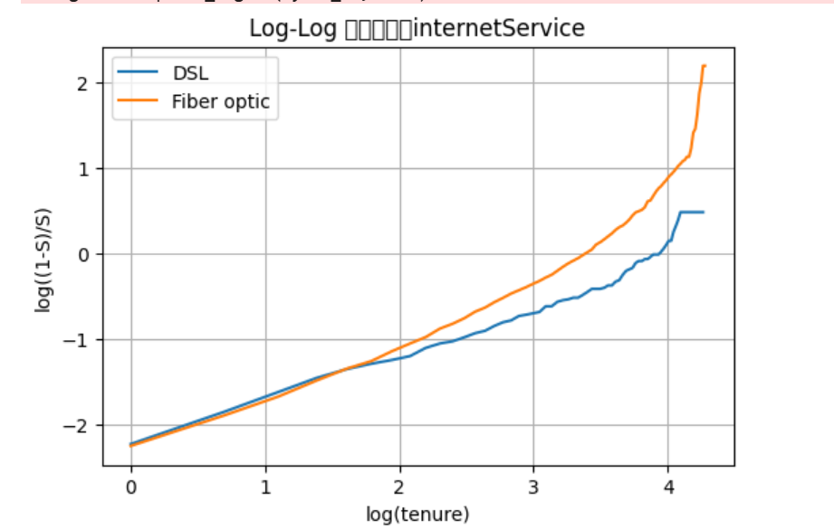

📈 图 16：log-log 曲线（internetService）

解读：
DSL 与 Fiber optic 曲线呈平行趋势，但 Fiber optic 用户风险更高。比例风险假设基本成立，支持使用 Cox 模型。

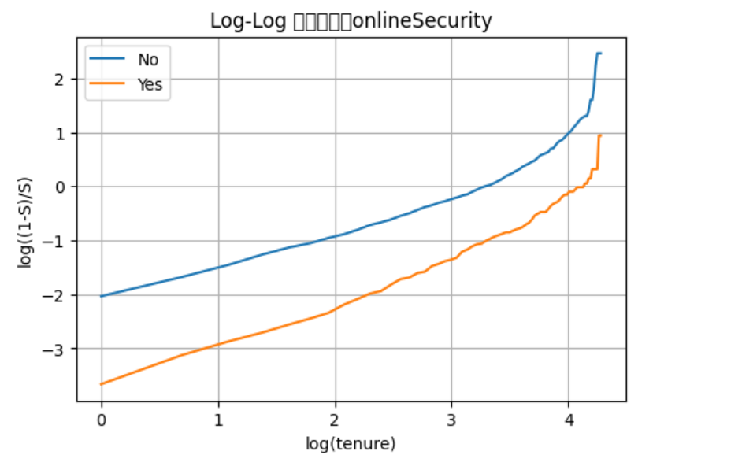

📈 图 17：log-log 曲线（onlineSecurity）

解读：
曲线间距大、平行性较好，onlineSecurity 对客户存留时间具有明显正向影响，且比例风险假设成立。

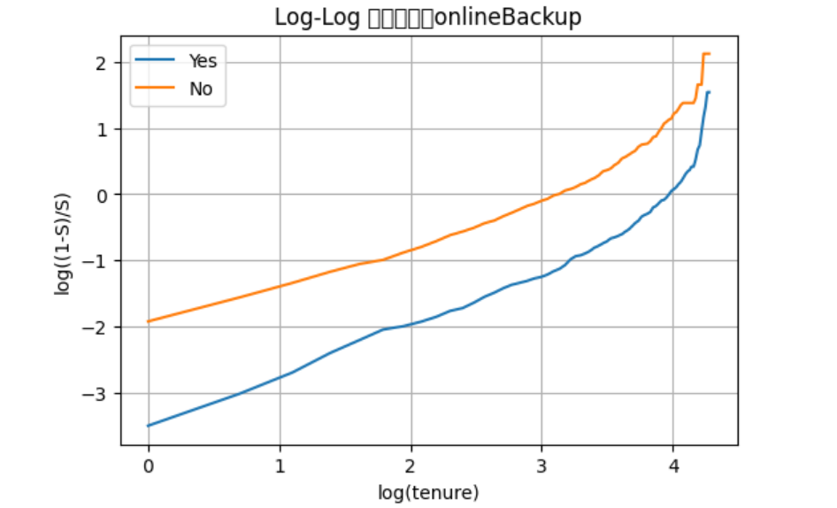

📈 图 18：log-log 曲线（onlineBackup）

解读：
开启在线备份的客户流失风险更低，两条曲线近似平行，支持其满足比例风险假设。

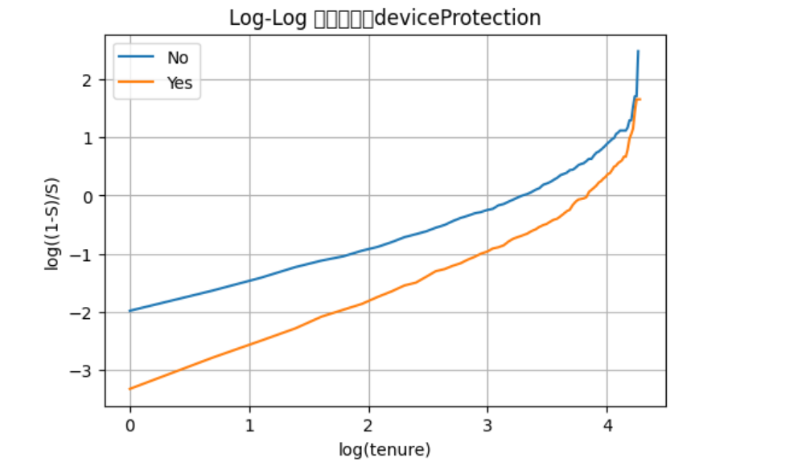

📈 图 19：log-log 曲线（deviceProtection）

解读：
使用设备保护服务的客户流失风险更低；两组曲线基本平行，支持 Cox 模型建模。

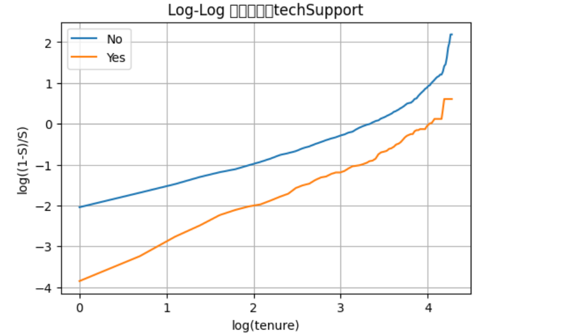

📈 图 20：log-log 曲线（techSupport）

解读：
获得技术支持的客户风险显著下降，曲线明显分离，且几乎平行，比例风险假设基本满足。

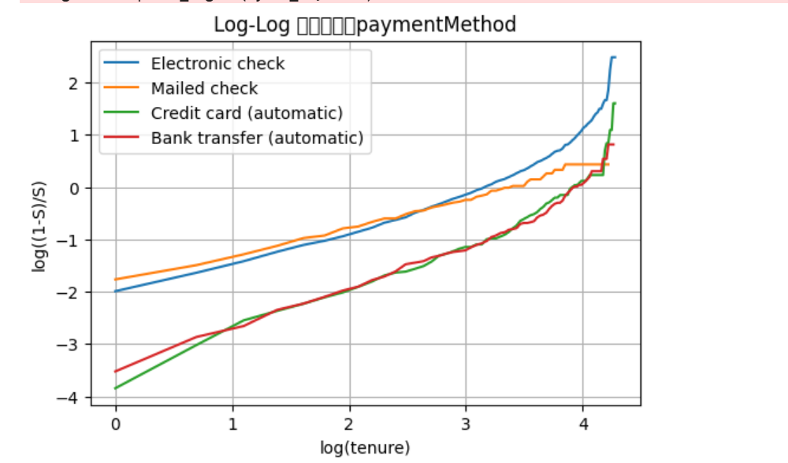

📈 图 21：log-log 曲线（paymentMethod）

解读：
不同支付方式下，客户流失风险差异明显。其中：

自动银行转账 / 信用卡支付者生存时间最长；

电子支票客户风险最高；

所有曲线呈近似平行，适用 Cox 模型建模。

## 模块 05：客户生命周期价值估算（05_customer_lifetime_value.py）

📌 **功能概述：**
- 利用 Cox 模型预测单个客户的生存概率
- 每月折现利润，估算累计 NPV
- 绘制生存概率曲线与净现值曲线

### 🧩 核心代码与解释：

```python
surv = cph.predict_survival_function(customer_input, times=range(1, 61))
```

预测某个客户（或特定特征组）的生存函数。

```python
result["Expected Monthly Profit"] = result["Survival Probability"] * monthly_profit
result["NPV"] = result["Expected Monthly Profit"] / ((1 + irr_monthly) ** result["Contract Month"])
result["Cumulative NPV"] = result["NPV"].cumsum()
```

每月利润乘以生存概率后折现为净现值（NPV），再计算累计值（CLV）。

```python
sns.lineplot(x="Contract Month", y="Cumulative NPV", data=result)
```

绘制客户价值增长趋势，用于回本周期分析和客户分层。

---

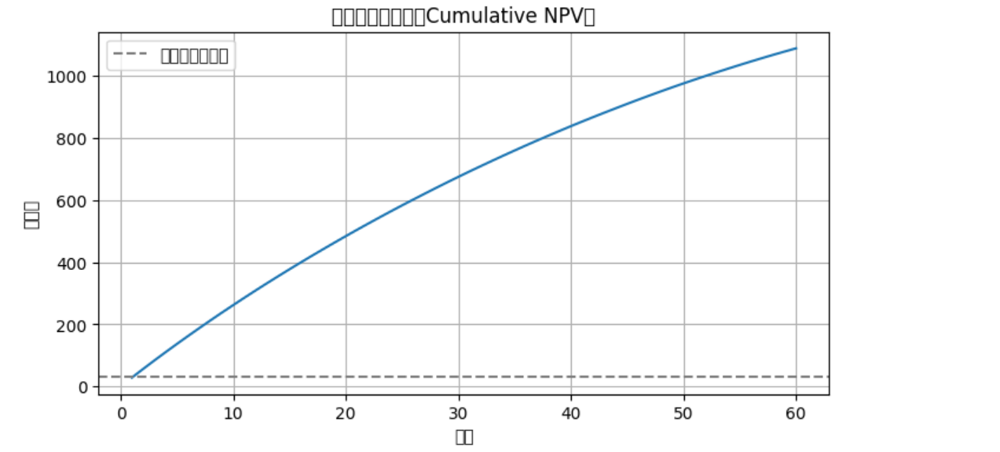

图 22：客户累计净现值（Cumulative NPV）

图像解读：

横轴为客户维持服务的“合同月份”（Contract Month），纵轴为累计净现值（Cumulative NPV）。

蓝色实线表示某类客户在未来 60 个月内的累计价值增长情况；

灰色虚线为参考基线，用于判断“回本时间”（NPV ≥ 0 的时刻）。

结论：

曲线呈现出持续上升趋势，说明随着时间推移，客户为公司带来的价值持续增加；

可据此评估不同客户群体的生命周期价值，并辅助进行客户分层与营销策略优化；

若某类客户的 NPV 曲线在前 12 个月迅速上升，可重点关注其短期价值开发。

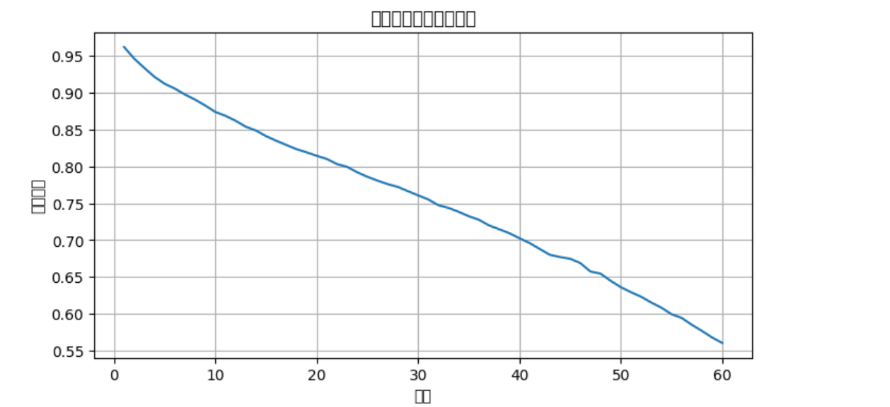

图 23：生存概率曲线（Survival Probability Over Time）

图像解读：

横轴为时间（月），纵轴为客户仍然未流失的“生存概率”；

曲线逐渐下降，代表随着服务时长增加，客户逐步流失，生存概率降低。

结论：

在第一个月时生存概率约为 96%，说明初期流失较少；

到第 60 个月生存概率降至约 55%，即有约 45% 的客户在此期间流失；

该曲线可作为预测客户流失时间的基础，结合 CLV 模型对营销时机进行精准控制。

## 总结

本次任务复现了从数据清洗、KM 分析、Cox/AFT 建模，到生命周期价值预测的完整生存分析流程。我们将原始的 Databricks 模块成功转换为本地 Jupyter 环境下可执行的 Python 脚本，并增强了解释性和可视化。
